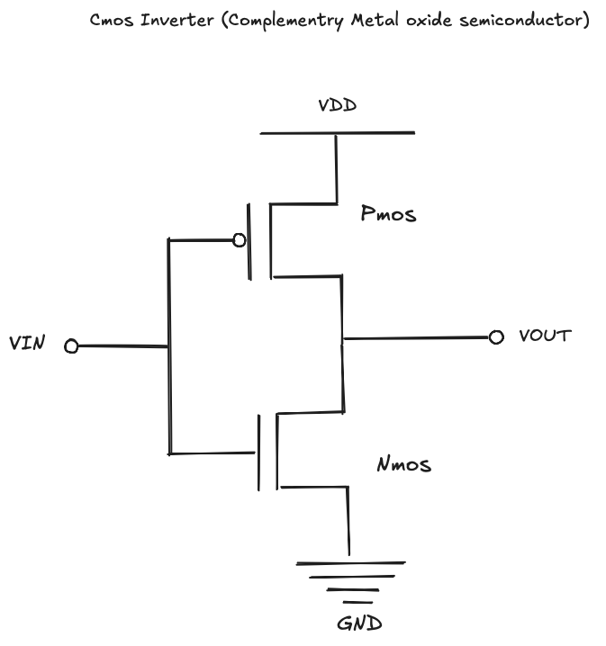
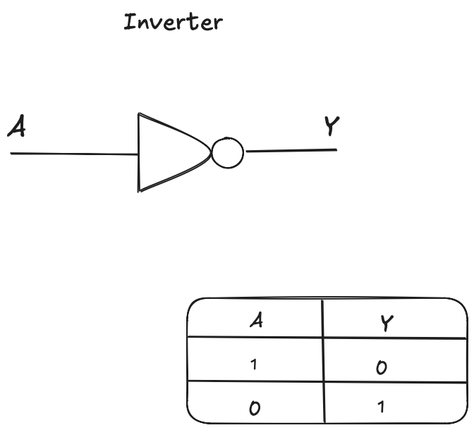

# CMOS Fundamentals

## The MOS Transistor

At its core, a MOS transistor is just a voltage-controlled switch. Apply enough voltage to the gate, and current flows between source and drain. Remove that voltage, and the path shuts off. That's the basic idea.

There are two flavors: NMOS and PMOS. They behave oppositely. An NMOS turns on when the gate is high—it's good at pulling outputs down to ground. A PMOS turns on when the gate is low—it's good at pulling outputs up to VDD. This opposite behavior isn't a quirk; it's exactly what makes CMOS work.

One thing worth noting: the gate draws almost no current. It's separated from the channel by oxide, so it's essentially capacitive. This means a single output can drive many gates without worrying about loading effects. That property becomes important when you're connecting thousands of gates together.

---

## The CMOS Inverter

Here's where it gets interesting. Take one NMOS, one PMOS, wire their gates together, and you get the most important circuit in digital design.

Look at the diagram above. The PMOS sits between VDD and the output. The NMOS sits between the output and ground. Both gates connect to the input.

When the input is low, the PMOS turns on and the NMOS turns off. The output gets pulled to VDD—that's a logic high. When the input is high, the opposite happens: NMOS on, PMOS off, output pulled to ground. High in, low out. Low in, high out. That's inversion.

What makes this clever is that there's never a direct path from VDD to ground in steady state. One transistor is always off. No path means no current, which means no static power. The only power you burn is during transitions, when both transistors are briefly on. This is why CMOS dominates—you can pack millions of transistors on a chip without melting it.

The other benefit: strong outputs. The output is always driven hard to one rail or the other through a low-resistance transistor. No weak pull-ups, no resistor dividers. You get clean logic levels with solid noise margins.

---

## Why This Matters

At higher levels of abstraction, we draw inverters as simple triangles with a bubble. We don't think about transistors when writing Verilog or running synthesis. But the transistor-level behavior is still there underneath, and it shapes everything.

When you see a timing report complaining about setup violations, that's transistors switching too slowly. When power analysis flags high dynamic power, that's gate capacitances charging and discharging. The abstractions are useful, but they're not magic—they're built on this stuff.

I find it helpful to keep this picture in mind even when working at RTL. It grounds the abstractions in something physical and makes the design trade-offs easier to reason about.
