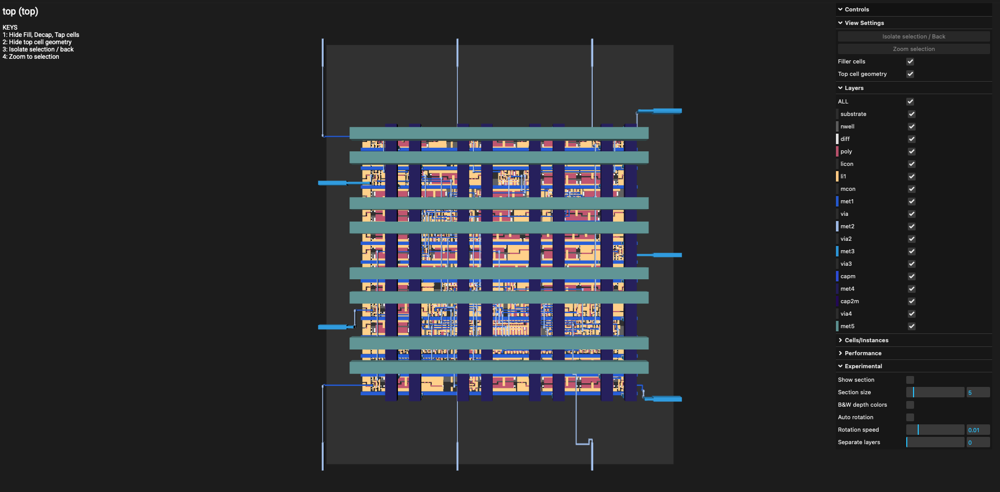
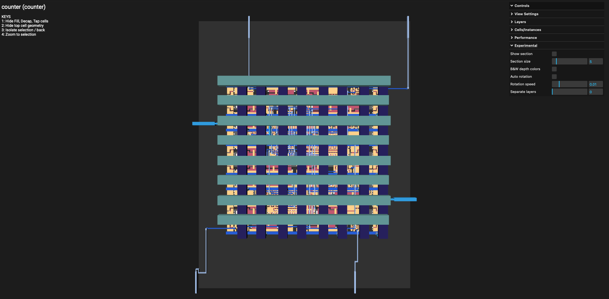

# GDSII Implementation Notes (OpenLane)

This folder contains the final layout outputs I generated using the OpenLane RTL-to-GDS flow with the SKY130 PDK.

## Files in this folder

- `top.gds`: Final layout for the `top` design, which integrates both the counter and adder modules.

- `counter_only.gds`: Layout generated for the standalone counter design.

## What I implemented

I started from Verilog RTL, verified the logic behavior in simulation, and then ran OpenLane to move through synthesis, floorplanning, placement, clock tree synthesis, routing, and final signoff checks. The result of this process is the GDSII data stored here.

For `top.gds`, the key goal was integration: combining two digital blocks (counter + adder) into one physical implementation while keeping the design clean and routable. For `counter_only.gds`, the goal was to understand the flow on a smaller and easier-to-debug block.

## What I learned while generating these GDS files

- Physical design is not just “automatic.” Good RTL structure and realistic constraints make a large difference in how smoothly the flow runs.
- Floorplan and utilization choices strongly affect routing quality and congestion.
- Clock definition must be consistent from the beginning, otherwise timing and CTS behavior become difficult to debug.
- Running the same flow on both a small block (`counter_only`) and an integrated block (`top`) helped me understand scaling effects.
- Seeing the final GDS in a layout viewer made the full ASIC flow concrete: Verilog code is eventually transformed into real geometric mask data.

## Reflection for university preparation

This was an important step in my preparation for VLSI studies in Taiwan. It helped me move from theory to implementation and gave me practical understanding of the complete digital ASIC pipeline. More importantly, it taught me how to debug design issues systematically instead of treating EDA tools as black boxes.
